# Telegram Bot Screen Flow

Complete visualization of all 45 Telegram bot screens with navigation flows.

## Overview

- **Total Screens**: 45
- **Categories**: Advanced, Authentication, Overview, Settings, Trading
- **Total Navigation Links**: 156

## Complete Screen Flow Diagram

The diagram below shows all screens with their names, preview text, and navigation CTAs.

```mermaid
flowchart TD

    %% Advanced Screens
    tpsl_manager["TP/SL Manager<br/>🎯 SET TP/SL              "]
    order_list["Order Management<br/>📋 MANAGE ORDERS          "]
    tpsl_custom["Custom TP/SL Input<br/>🎯 Custom TP/SL           "]
    order_detail["Order Details<br/>📋 Order Details          "]
    confirm_cancel_order["Confirm Cancel Order<br/>🔴 Confirm Cancel Order   "]
    confirm_cancel_all["Confirm Cancel All Orders<br/>🔴 Confirm Cancel All     "]
    confirm_tpsl["Confirm TP/SL Orders<br/>🔴 Confirm TP/SL Orders   "]
    confirm_clear_tpsl["Confirm Clear TP/SL<br/>🔴 Confirm Clear TP/SL    "]

    %% Authentication Screens
    welcome["Welcome Screen<br/>👋 Welcome to StableSolid "]
    link_wizard_step1["API Setup - Step 1<br/>🔗 Link Your AsterDEX     "]
    mini_app_auth_aster["Aster DEX Wallet Connect<br/>🔐 Connect to Aster DEX   "]
    link_wizard_aster["Aster DEX API Setup<br/>🔗 Aster DEX API Setup    "]
    link_wizard_aster_step2["Aster DEX API Key<br/>🔑 Aster DEX API Key      "]
    validating_aster["Validating Aster Connection<br/>⏳ Validating Aster DEX   "]
    auth_error_aster["Aster Connection Failed<br/>❌ Connection Failed      "]
    mini_app_auth_hyperliquid["Hyperliquid Wallet Connect<br/>🔐 Connect to Hyperliquid "]
    link_wizard_hyperliquid["Hyperliquid API Setup<br/>🔗 Hyperliquid API Setup  "]
    link_wizard_hyperliquid_step2["Hyperliquid API Key<br/>🔑 Hyperliquid API Key    "]
    validating_hyperliquid["Validating Hyperliquid Connection<br/>⏳ Validating Hyperliquid "]
    auth_error_hyperliquid["Hyperliquid Connection Failed<br/>❌ Connection Failed      "]
    link_wizard_step2["API Setup - Step 2<br/>🔗 Link Your AsterDEX     "]
    validating["Validating Connection<br/>⏳ Validating Your        "]
    confirm_connect_hyperliquid["Connect Hyperliquid<br/>🔗 Connect Hyperliquid    "]
    exchange_selection_hyperliquid["Link Hyperliquid<br/>🔗 Link Hyperliquid       "]
    confirm_connect_aster["Connect Aster DEX<br/>🔗 Connect Aster DEX      "]
    exchange_selection_aster["Link Aster DEX<br/>🔗 Link Aster DEX         "]

    %% Overview Screens
    universal_citadel["Universal Command Citadel<br/>🌍 Universal Command Citad"]
    citadel_aster["Aster Command Citadel<br/>🏰 Command Citadel        "]
    citadel_hyperliquid["Hyperliquid Command Citadel<br/>🏰 Hyperliquid Command    "]
    all_assets_universal["All Assets (Universal)<br/>📊 All Assets (Universal) "]

    %% Settings Screens
    settings["Settings Menu<br/>⚙️  Settings             "]
    help["Help & Documentation<br/>📚 Help & Documentation   "]
    settings_universal["Universal Settings<br/>⚙️ Universal Settings    "]

    %% Trading Screens
    search_results["Search Results<br/>🔍 Search Results for 'SOL"]
    position_no_open["New Position Panel<br/>⚡ SOLUSDT - New Position "]
    position_with_open["Position Management<br/>⚡ Manage SOLUSDT Position"]
    confirm_add["Confirm Add to Position<br/>🔴 Confirm Operation      "]
    confirm_close["Confirm Close Position<br/>🔴 Confirm Close          "]
    confirm_order["Confirm Order<br/>🔴 Confirm Operation      "]
    executing["Executing Order<br/>⏳ Executing Order...     "]
    order_success["Order Success<br/>✅ Position Opened        "]
    custom_amount["Custom Amount Input<br/>💰 Enter Custom Amount    "]
    custom_sell["Custom Sell Amount<br/>💰 Custom Sell Amount     "]
    search_prompt_universal["Search Symbol (Universal)<br/>🔍 Search Symbol          "]
    search_results_universal["Search Results (Universal)<br/>🔍 Search Results for 'SOL"]

    %% Navigation Flows
    welcome -->|"Click Aster DEX"| exchange_selection_aster
    welcome -->|"Click Hyperliquid"| exchange_selection_hyperliquid
    welcome -->|"Click Help"| help
    link_wizard_step1 -->|"User types wallet "| link_wizard_step2
    link_wizard_step1 -->|"Click Cancel"| welcome
    mini_app_auth_aster -->|"Wallet Connected"| validating_aster
    mini_app_auth_aster -->|"Click Refresh Stat"| mini_app_auth_aster
    mini_app_auth_aster -->|"Click Cancel"| exchange_selection_aster
    mini_app_auth_aster -->|"Connection Failed"| auth_error_aster
    link_wizard_aster -->|"User enters wallet"| link_wizard_aster_step2
    link_wizard_aster -->|"Click Back"| exchange_selection_aster
    link_wizard_aster -->|"Click Cancel"| universal_citadel
    link_wizard_aster_step2 -->|"User enters API ke"| validating_aster
    link_wizard_aster_step2 -->|"Click Back"| link_wizard_aster
    link_wizard_aster_step2 -->|"Click Cancel"| universal_citadel
    validating_aster -->|"Success"| universal_citadel
    validating_aster -->|"Failure"| auth_error_aster
    auth_error_aster -->|"Click Try Again"| link_wizard_aster
    auth_error_aster -->|"Click Change Setti"| exchange_selection_aster
    auth_error_aster -->|"Click Cancel"| universal_citadel
    mini_app_auth_hyperliquid -->|"Wallet Connected"| validating_hyperliquid
    mini_app_auth_hyperliquid -->|"Click Refresh Stat"| mini_app_auth_hyperliquid
    mini_app_auth_hyperliquid -->|"Click Cancel"| exchange_selection_hyperliquid
    mini_app_auth_hyperliquid -->|"Connection Failed"| auth_error_hyperliquid
    link_wizard_hyperliquid -->|"User enters wallet"| link_wizard_hyperliquid_step2
    link_wizard_hyperliquid -->|"Click Back"| exchange_selection_hyperliquid
    link_wizard_hyperliquid -->|"Click Cancel"| universal_citadel
    link_wizard_hyperliquid_step2 -->|"User enters API ke"| validating_hyperliquid
    link_wizard_hyperliquid_step2 -->|"Click Back"| link_wizard_hyperliquid
    link_wizard_hyperliquid_step2 -->|"Click Cancel"| universal_citadel
    validating_hyperliquid -->|"Success"| universal_citadel
    validating_hyperliquid -->|"Failure"| auth_error_hyperliquid
    auth_error_hyperliquid -->|"Click Try Again"| link_wizard_hyperliquid
    auth_error_hyperliquid -->|"Click Change Setti"| exchange_selection_hyperliquid
    auth_error_hyperliquid -->|"Click Cancel"| universal_citadel
    link_wizard_step2 -->|"User types private"| validating
    link_wizard_step2 -->|"Click Back"| link_wizard_step1
    link_wizard_step2 -->|"Click Cancel"| welcome
    validating -->|"Success"| universal_citadel
    universal_citadel -->|"Click Aster DEX"| citadel_aster
    universal_citadel -->|"Click Hyperliquid"| citadel_hyperliquid
    universal_citadel -->|"Click Connect Hype"| confirm_connect_hyperliquid
    universal_citadel -->|"Click Connect Aste"| confirm_connect_aster
    universal_citadel -->|"Click All Assets"| all_assets_universal
    universal_citadel -->|"Click Trade"| search_prompt_universal
    universal_citadel -->|"Click Settings"| settings_universal
    universal_citadel -->|"Click Help"| help
    citadel_aster -->|"Click position (e."| position_with_open
    citadel_aster -->|"Click Settings"| settings
    citadel_aster -->|"Click Help"| help
    citadel_aster -->|"Click Refresh"| citadel_aster
    citadel_aster -->|"Click Back to Univ"| universal_citadel
    citadel_hyperliquid -->|"Click position (e."| position_with_open
    citadel_hyperliquid -->|"Click Settings"| settings
    citadel_hyperliquid -->|"Click Refresh"| citadel_hyperliquid
    citadel_hyperliquid -->|"Click Back to Univ"| universal_citadel
    search_results -->|"Click SOLUSDT"| position_no_open
    position_no_open -->|"Click 🔄 Market/Lim"| position_no_open
    position_no_open -->|"Click Long $50"| confirm_order
    position_no_open -->|"Click Long $200"| confirm_order
    position_no_open -->|"Click Long X"| custom_amount
    position_no_open -->|"Click Short $50"| confirm_order
    position_no_open -->|"Click Short $200"| confirm_order
    position_no_open -->|"Click Short X"| custom_amount
    position_no_open -->|"Click Cross"| position_no_open
    position_no_open -->|"Click Refresh"| position_no_open
    position_with_open -->|"Click 🔄 Market/Lim"| position_with_open
    position_with_open -->|"Click Ape $50"| confirm_add
    position_with_open -->|"Click Ape $200"| confirm_add
    position_with_open -->|"Click Ape X"| custom_amount
    position_with_open -->|"Click Close All"| confirm_close
    position_with_open -->|"Click Sell 25%"| confirm_close
    position_with_open -->|"Click Sell 69%"| confirm_close
    position_with_open -->|"Click Sell X"| custom_sell
    position_with_open -->|"Click Cross/Isolat"| position_with_open
    position_with_open -->|"Click Set TP/SL"| tpsl_manager
    position_with_open -->|"Click Manage Order"| order_list
    position_with_open -->|"Click Refresh"| position_with_open
    confirm_add -->|"Click Confirm Add"| executing
    confirm_add -->|"Click Cancel"| position_with_open
    confirm_close -->|"Click Confirm Clos"| executing
    confirm_close -->|"Click Cancel"| position_with_open
    confirm_order -->|"Click Confirm"| executing
    confirm_order -->|"Click Re-calc"| confirm_order
    confirm_order -->|"Click Cancel"| position_no_open
    executing -->|"Success"| order_success
    order_success -->|"Click Set TP/SL"| tpsl_manager
    order_success -->|"Click View Positio"| position_with_open
    order_list -->|"Click View (on any"| order_detail
    order_list -->|"Click Cancel (on a"| confirm_cancel_order
    order_list -->|"Click Cancel All O"| confirm_cancel_all
    order_list -->|"Click Back"| position_with_open
    help -->|"Click Settings"| settings
    custom_amount -->|"User types amount"| confirm_order
    custom_amount -->|"Click quick amount"| confirm_order
    custom_amount -->|"Click Cancel"| position_no_open
    custom_sell -->|"User types percent"| confirm_close
    custom_sell -->|"User types USDT am"| confirm_close
    custom_sell -->|"User types SOL qua"| confirm_close
    custom_sell -->|"Click Cancel"| position_with_open
    tpsl_custom -->|"User enters TP pri"| tpsl_manager
    tpsl_custom -->|"User enters SL pri"| tpsl_manager
    tpsl_custom -->|"Click Set"| confirm_tpsl
    tpsl_custom -->|"Click Cancel"| tpsl_manager
    order_detail -->|"Click Cancel Order"| confirm_cancel_order
    order_detail -->|"Click Back"| order_list
    confirm_cancel_order -->|"Click Confirm Canc"| order_list
    confirm_cancel_order -->|"Click Cancel"| order_detail
    confirm_cancel_all -->|"Click Confirm Canc"| order_list
    confirm_cancel_all -->|"Click Cancel"| order_list
    confirm_tpsl -->|"Click Confirm"| executing
    confirm_tpsl -->|"Click Cancel"| tpsl_manager
    confirm_clear_tpsl -->|"Click Confirm Clea"| executing
    confirm_clear_tpsl -->|"Click Cancel"| tpsl_manager
    confirm_connect_hyperliquid -->|"Click Connect Hype"| exchange_selection_hyperliquid
    confirm_connect_hyperliquid -->|"Click Cancel"| universal_citadel
    exchange_selection_hyperliquid -->|"Click WalletConnec"| mini_app_auth_hyperliquid
    exchange_selection_hyperliquid -->|"Click API Key"| link_wizard_hyperliquid
    exchange_selection_hyperliquid -->|"Click Back"| welcome
    confirm_connect_aster -->|"Click Connect Aste"| exchange_selection_aster
    confirm_connect_aster -->|"Click Cancel"| universal_citadel
    exchange_selection_aster -->|"Click WalletConnec"| mini_app_auth_aster
    exchange_selection_aster -->|"Click API Key"| link_wizard_aster
    exchange_selection_aster -->|"Click Back"| welcome
    all_assets_universal -->|"Click Refresh"| all_assets_universal
    all_assets_universal -->|"Click Back"| universal_citadel
    search_prompt_universal -->|"User types symbol"| search_results_universal
    search_prompt_universal -->|"Click Back"| universal_citadel
    search_results_universal -->|"Click Aster DEX"| position_no_open
    search_results_universal -->|"Click Hyperliquid"| position_no_open
    search_results_universal -->|"Click New Search"| search_prompt_universal
    search_results_universal -->|"Click Back"| universal_citadel
    settings_universal -->|"Click Aster Settin"| settings
    settings_universal -->|"Click Hyperliquid "| settings
    settings_universal -->|"Click Back"| universal_citadel
```



## Screen Categories

### Advanced
- **TP/SL Manager** (`tpsl_manager`)
- **Order Management** (`order_list`)
- **Custom TP/SL Input** (`tpsl_custom`)
- **Order Details** (`order_detail`)
- **Confirm Cancel Order** (`confirm_cancel_order`)
- **Confirm Cancel All Orders** (`confirm_cancel_all`)
- **Confirm TP/SL Orders** (`confirm_tpsl`)
- **Confirm Clear TP/SL** (`confirm_clear_tpsl`)
### Authentication
- **Welcome Screen** (`welcome`)
- **API Setup - Step 1** (`link_wizard_step1`)
- **Aster DEX Wallet Connect** (`mini_app_auth_aster`)
- **Aster DEX API Setup** (`link_wizard_aster`)
- **Aster DEX API Key** (`link_wizard_aster_step2`)
- **Validating Aster Connection** (`validating_aster`)
- **Aster Connection Failed** (`auth_error_aster`)
- **Hyperliquid Wallet Connect** (`mini_app_auth_hyperliquid`)
- **Hyperliquid API Setup** (`link_wizard_hyperliquid`)
- **Hyperliquid API Key** (`link_wizard_hyperliquid_step2`)
- **Validating Hyperliquid Connection** (`validating_hyperliquid`)
- **Hyperliquid Connection Failed** (`auth_error_hyperliquid`)
- **API Setup - Step 2** (`link_wizard_step2`)
- **Validating Connection** (`validating`)
- **Connect Hyperliquid** (`confirm_connect_hyperliquid`)
- **Link Hyperliquid** (`exchange_selection_hyperliquid`)
- **Connect Aster DEX** (`confirm_connect_aster`)
- **Link Aster DEX** (`exchange_selection_aster`)
### Overview
- **Universal Command Citadel** (`universal_citadel`)
- **Aster Command Citadel** (`citadel_aster`)
- **Hyperliquid Command Citadel** (`citadel_hyperliquid`)
- **All Assets (Universal)** (`all_assets_universal`)
### Settings
- **Settings Menu** (`settings`)
- **Help & Documentation** (`help`)
- **Universal Settings** (`settings_universal`)
### Trading
- **Search Results** (`search_results`)
- **New Position Panel** (`position_no_open`)
- **Position Management** (`position_with_open`)
- **Confirm Add to Position** (`confirm_add`)
- **Confirm Close Position** (`confirm_close`)
- **Confirm Order** (`confirm_order`)
- **Executing Order** (`executing`)
- **Order Success** (`order_success`)
- **Custom Amount Input** (`custom_amount`)
- **Custom Sell Amount** (`custom_sell`)
- **Search Symbol (Universal)** (`search_prompt_universal`)
- **Search Results (Universal)** (`search_results_universal`)

## Navigation Examples

Sample navigation flows from key screens:

### Welcome Screen (`welcome`)
- Click Aster DEX → `exchange_selection_aster`
- Click Hyperliquid → `exchange_selection_hyperliquid`
- Click Help → `help`

### API Setup - Step 1 (`link_wizard_step1`)
- User types wallet address → `link_wizard_step2`
- Click Cancel → `welcome`

### Aster DEX Wallet Connect (`mini_app_auth_aster`)
- Wallet Connected → `validating_aster`
- Click Refresh Status → `mini_app_auth_aster`
- Click Cancel → `exchange_selection_aster`
- Connection Failed → `auth_error_aster`

### Aster DEX API Setup (`link_wizard_aster`)
- User enters wallet address → `link_wizard_aster_step2`
- Click Back → `exchange_selection_aster`
- Click Cancel → `universal_citadel`

### Aster DEX API Key (`link_wizard_aster_step2`)
- User enters API key → `validating_aster`
- Click Back → `link_wizard_aster`
- Click Cancel → `universal_citadel`

### Validating Aster Connection (`validating_aster`)
- Success → `universal_citadel`
- Failure → `auth_error_aster`

### Aster Connection Failed (`auth_error_aster`)
- Click Try Again → `link_wizard_aster`
- Click Change Settings → `exchange_selection_aster`
- Click Cancel → `universal_citadel`

### Hyperliquid Wallet Connect (`mini_app_auth_hyperliquid`)
- Wallet Connected → `validating_hyperliquid`
- Click Refresh Status → `mini_app_auth_hyperliquid`
- Click Cancel → `exchange_selection_hyperliquid`
- Connection Failed → `auth_error_hyperliquid`

### Hyperliquid API Setup (`link_wizard_hyperliquid`)
- User enters wallet address → `link_wizard_hyperliquid_step2`
- Click Back → `exchange_selection_hyperliquid`
- Click Cancel → `universal_citadel`

### Hyperliquid API Key (`link_wizard_hyperliquid_step2`)
- User enters API key → `validating_hyperliquid`
- Click Back → `link_wizard_hyperliquid`
- Click Cancel → `universal_citadel`

*... and 35 more screens with their navigation flows*

## Usage

Import screens in your bot code:

```typescript
import { AGENTIFI_SCREENS, ScreenKey } from './test/screen-definitions';

// Access any screen
const screen = AGENTIFI_SCREENS.welcome;
console.log(screen.name, screen.navigation);
```

---

**Generated**: 1766322502.5314746  
**Source**: `screen-definitions.ts`  
**Screens**: 45  
**Categories**: 5
